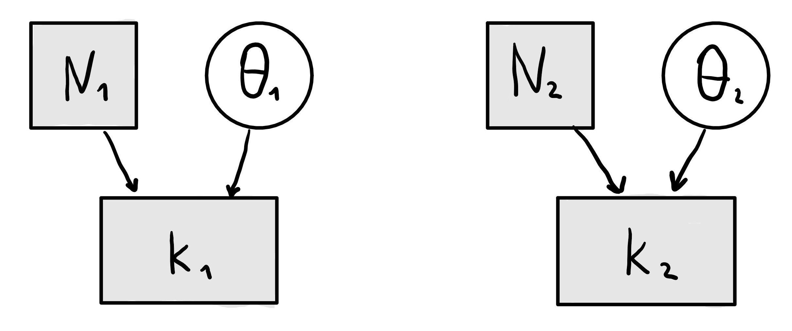

```{r setup, include=FALSE}

knitr::opts_chunk$set(echo = TRUE, error = F, message = F, warning = F)

```

```{r libraries, include=FALSE, message=FALSE, warning=FALSE}

# package for convenience functions (e.g. ggplot2, dplyr, etc.)
library(tidyverse)

# package for this course
library(aida)

# use the aida-theme for plotting
theme_set(theme_aida())

# global color scheme / non-optimized
project_colors = c("#E69F00", "#56B4E9", "#009E73", "#F0E442", "#0072B2", "#D55E00", "#CC79A7", "#000000")

# setting theme colors globally
scale_colour_discrete <- function(...) {
  scale_colour_manual(..., values = project_colors)
}
scale_fill_discrete <- function(...) {
   scale_fill_manual(..., values = project_colors)
} 

# nicer global knitr options
knitr::opts_chunk$set(warning = FALSE, message = FALSE, 
                      cache = TRUE, fig.align = 'center')


```

# Instructions

* Create an Rmd-file with your group number (equivalent to StudIP group) in the 'author' heading and answer the following questions.
* When all answers are ready, 'Knit' the document to produce a HTML file.
* Create a ZIP archive called "IDA_HW04-Group-XYZ.zip" (where 'XYZ' is *your* group number) containing:
   * an R Markdown file "IDA_HW04-Group-XYZ.Rmd"
   * a knitted HTML document "IDA_HW04-Group-XYZ.html"
   * any other files necessary to compile your Rmarkdown to HTML (data, pictures etc.)
* Upload the ZIP archive on Stud.IP in your group folder before the deadline (see above). You may upload as many times as you like before the deadline, only your final submission will count.

# <span style = "color:firebrick">Exercise 1:</span> Inspect, preprocess & plot the data [15 points]

## Ex 1.a Load and inspect the data [1 point]

Thanks to everyone who had time and energy to complete the Simon task, we have data to analyze fresh data generated by yourselves.
Load the data you and/or your peers generated into a variable called `data_ST` and display the first seven rows of the data set.

```{r}

data_ST <- read_csv("data-Simon-Task-minimal.csv")

head(data_ST, 7)

```

## Ex 1.b Determine the number of participants [1 point]

Use R to extract the number of participants in the data set.

```{r}

data_ST %>% group_by(submission_id) %>% summarise(sum = n()) %>% nrow() 


```

## Ex 1.c Identify variables of interest [2 points]

Based on the hypotheses formulated in [Chapter D.2 of the web-book](https://michael-franke.github.io/intro-data-analysis/simon-task.html), which of the columns in the data tibble represent the main indendent and dependent variables of interest?

```{r}

# --> highest interest:  influence of congruency on the reaction times in the trials where participants gave a correct answer

# Independent variables: condition and key_pressed
# Dependent variables: RT and correctness
```

## Ex 1.d By-participant mean correctness and mean RT [2 points]

Create a tibble in which each row shows the proportion of "correct" answers and the mean reaction time for a different participant. So, this tibble will have as many rows as there are participants in the data set. (**Hint:** Use a sequence of `group_by` and `summarize`.)

Plot the by-participant summary statistics in this tibble in a scatter plot, showing the proportion of "correct" answers on the $x$-axis and the mean reaction times on the $y$-axis. (Just for clarity: Every point in this plot represents one participant.)

(Rationale for doing this: Even though we will not draw direct conclusions from this plot here, visualizing your data like shown here is usually a good way of getting familiar with what you are dealing with.))

```{r}

# creating a By-participant mean correctness and mean RT tibble
by_participant <- data_ST %>% group_by(submission_id) %>% summarize(mean_reaction_time = mean(RT), proportion_correct_answers = mean(correctness == "correct")) 
by_participant

#  scatter plot, showing the proportion of “correct” answers on the x-axis and the mean reaction times on the y-axis. (Just for clarity: Every point in this plot represents one participant.)

by_participant %>% 
  ggplot(aes(x = log(proportion_correct_answers), y = mean_reaction_time, fill = submission_id)) +
  geom_point(
    size = 5,
    shape = 23
  )+ 
  labs(
    x = "Proportion of correct answers", 
    y = "Mean Reaction time",
    title = "By-participant mean correctness and mean RT"
  )

```

## Ex 1.e Remove participants [3 points]

Remove all data from all participants who gave less than 50% correct answers or whose mean reaction time is smaller than 350ms or larger than 750ms.
Use R to output information about how many participants have been excluded in this way.

```{r}

# removing all data less than 50 % correct answers & reaction time is smaller than 350 / larger than 750 
modified_dataset <- by_participant %>% .[(.[,3]>0.5),] %>% .[(.[,2]<750),] %>% .[(.[,2]>350),]
modified_dataset


# output how many participants are excluded this way


# calculating amount of participants before and after modification
amount_participants <- data_ST %>% group_by(submission_id) %>% summarise(sum = n()) %>% nrow() 
amount_participants_modified <- modified_dataset %>% group_by(submission_id) %>% summarise(sum = n()) %>% nrow() 

# subtracting those numbers
excluded_participants <- amount_participants - amount_participants_modified
print(excluded_participants)

```

## Ex 1.f Remove individual trials [3 points]

Exclude all trials with reaction times longer than 1 second or shorter than 100 ms.
Use R to output information about how many trials have been excluded in this way.

```{r}

modified_dataset <- data_ST %>% group_by(trial_number) %>%  .[(.[,7]<1000),] %>% .[(.[,7]>100),] 
modified_dataset


# output how many (individual) trials have been excluded in this way 
before <- data_ST  %>% group_by(submission_id, trial_number) %>% nrow() 
after <- modified_dataset %>% group_by(submission_id, trial_number) %>% nrow() 
before - after


```

## Ex 1.g Show summary statistics [3 points]

Produce a tibble which shows in each row, one row for each condition, the overall (group-level) proportion of correct answers and the mean of all reaction times per condition.

What would you conclude based on these summary statistics about either or both of the relevant research hypotheses, as spelled out in [Chapter D.2 of the web-book](https://michael-franke.github.io/intro-data-analysis/simon-task.html)?

```{r}

sum_stat <- data_ST %>% group_by(condition) %>% summarise(mean_reaction_time = mean(RT), proportion_correct_answers = mean(correctness == "correct"))
sum_stat 


# What would you conclude based on these summary statistics about either or both of the relevant research hypotheses, as spelled out in Chapter D.2 of the web-book?
'
--> more errors in the incongruent condition than in the congruent condition
--> it takes longer to make correct responses in the incongruent condition than in the congruent condition'

# therefore we assume that stimulus location interferes with information processing

```

# <span style = "color:firebrick">Exercise 2:</span> Testing the accuracy hypothesis [20 points]

## Ex 2.a A model for the accuracy difference [2 points]

```{r}



```

We want to test the directed hypothesis that the accuracy (i.e., the proportion of correct responses) is higher in the congruent condition than in the incongruent condition.
To do so, we use a model which is very similar to the model we used for the BioNTec/Pfizer data from the last homework.
The only difference is that we are not interested in the "efficiency" of a treatment, but in the plain difference $\delta = \theta_1 - \theta_2$ between the latent accuracy scores $\theta_1$ (for the congruent condition) and $\theta_2$ (for the incongruent condition).

Here is the model in math.

$$
\begin{align*}
  \theta_1 & \sim \text{Beta}(1,1) \\
  k_1 & \sim \text{Binomial}(\theta_1, N_1) \\
  \theta_1 & \sim \text{Beta}(1,1) \\
  k_2 & \sim \text{Binomial}(\theta_2, N_2) \\
  \delta & = \theta_1 - \theta_2
\end{align*}
$$

Based on the conventions used in the webbook, draw a graphical representation of this model and include it using Rmarkdown into the HTML output of your submission. You can use a photo of a hand-drawn model, or use any kind of software. Just don’t waste too much time on the aesthetics! Make sure to include the picture in your ZIP-submission and integrate.

## Ex 2.b Specify the accuracy hypothesis formally [1 points]

State the *accuracy hypothesis* (that the accuracy (i.e., the proportion of correct responses) is higher in the congruent condition than in the incongruent condition) formally as a mathematical statement about a single variable of the model from above.

```{r}

'delta > 0'


```

## Ex 2.c Testing via estimation and Kruschke's ternary decision logic [10 points]

Based on the model from above, we will test the accuracy hypothesis, using an estimation-based approach, based on 95% credible intervals and Kruschke's ternary decision logic for our final conclusions.

To do this, follow these steps:

1. get the relevant counts:
  - number of "correct" answers $k_1$ out of $N_1$ congruent trials
  - number of "correct" answers $k_2$ out of $N_2$ incongruent trials

2. get 10,000 samples from the posterior of the latent parameters $\theta_1$ and $\theta_2$ using conjugacy

3. compute (derived) samples from the posterior of $\delta$

4. compute the 95% credible interval for the vector of samples of posterior values of $\delta$

5. draw conclusions from this computation about the research hypothesis, following Kruschke's ternary decision logic

```{r}

# number of “correct” answers k1 out of N1 congruent trials and
# number of “correct” answers k2 out of N2 incongruent trials
simon_data_4_Stan <- list(
  N1 = nrow(data_ST %>% filter(condition == "congruent")),
  k1 = nrow(data_ST %>% filter(condition == "congruent", correctness == "correct")),
  N2 = nrow(data_ST %>% filter(condition == "incongruent")),
  k2 = nrow(data_ST %>% filter(condition == "incongruent", correctness == "correct"))
)


# 10,000 samples from the posterior of the latent parameters θ1 and θ2 using conjugacy


# sampling
stan_fit_ttest <- rstan::stan(
  
  # Stan code
  file = 'ttest_model.stan',
  
  # data to supply to the Stan program
  data = simon_data_4_Stan,
  
  # iterations 
  iter = 10000,
  
  # how many warmup steps
  warmup = 1000
  
  )

print(stan_fit_ttest)

# first of all compute delta : therefore samples are needed
tidy_samples <- tidybayes::tidy_draws(stan_fit_ttest) %>% select(theta1, theta2) %>% mutate(delta = theta1 - theta2)
tidy_samples 

# creating samples from delta posterior
delta_samples <- tidy_samples %>% select(delta)

# computing 95 per cent Interval from delta posterior
Bayes_estimates_ST <- delta_samples %>% 
  aida::summarize_sample_vector('delta')
Bayes_estimates_ST

#--> draw conclusions:  ϵ-region around θ∗i meaning delta has to be positive 
#--> yes it is positive and therefore the hypothesis have to be accepted according to the Kruschke logic 


```

## Ex 2.d Testing via comparison using an embedding model [7 points]

We want to use the encompassing models approach to calculate the Bayes factor of the accuracy hypothesis compared against its logical complement.
Notice that the model we specified in the first part of this exercise *is* an encompassing model which contains the accuracy hypothesis and its logical complement as special cases.
As described in the web-book, we can use the following formula to compute the relevant Bayes factor.

$$ 
\begin{aligned}
\text {BF}_{01} & = \frac{\text{posterior-odds of } H_0}{\text{prior-odds of } H_0}  \\
& = \frac{P_M(\theta \in I_0 \mid D)}{P_M(\theta \not \in I_0 \mid D)} \frac{P_M(\theta \not \in I_0)}{P_M(\theta \in I_0)}
\end{aligned}
$$

We are going to compute this quantity, approximately, using samples, following these steps.

First, reason in intuitive (informal) language why we can safely neglect the prior odds term

$$ 
\begin{aligned}
\frac{P_M(\theta \not \in I_0)}{P_M(\theta \in I_0)}
\end{aligned}
$$

You could also give a mathematical proof, or any other (informal or formal) argument to support your case. (E.g., maybe a sampling-based argument.)

```{r}

# We can safely neglect the prior odds term because the quotient amounts to 1.
# This is because the probability that a value is within the boundaries of a
# half-closed #interval is the same likelihood that it is not within these
# boundaries. The model works with ex ante predictions.

```

Second, use the samples in `delta_samples` from the previous exercise to approximate:

$$ 
\begin{aligned}
\frac{P_M(\theta \in I_0 \mid D)}{P_M(\theta \not \in I_0 \mid D)}
\end{aligned}
$$

```{r}

# calculate posterior odds of the ROPE-d hypothesis
posterior_odd_1 <- mean(delta_samples[delta_samples > 0] )
posterior_odd_2 <- mean(delta_samples[delta_samples <= 0] )
# calculate Bayes factor
bf_ROPEd_hypothesis <- posterior_odd_1 -posterior_odd_2
bf_ROPEd_hypothesis


```

Third, interpret this result.

```{r}

# The result have to be not available since when plotting the distribution we 
# see that there is no area lower or equal to 0. This is why we accept the 
# accuracy hypothesis, that the accuracy in congruent trials is higher than in
# incongruent trials.

```


